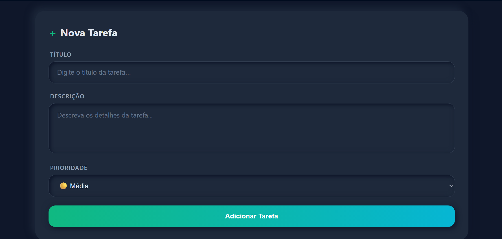
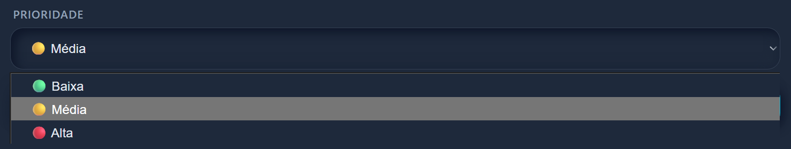

# 📝 Simplify

> *Simplifique seu dia a dia, uma tarefa de cada vez*

---

```markdown


```

## 🌟 Sobre o Projeto

**Simplify** é uma aplicação moderna de gerenciamento de tarefas criada para tornar sua rotina mais organizada e produtiva. Com um design elegante em dark mode e uma interface super intuitiva, você pode adicionar, acompanhar e completar suas tarefas de forma simples e visual.

A ideia por trás do Simplify é clara: **eliminar a complexidade** e focar no que realmente importa - suas tarefas e objetivos. Sem distrações, sem complicações, apenas você e suas metas.

---

## ✨ Funcionalidades

- ✅ **Adicionar tarefas** - Crie novas tarefas com título e descrição detalhada
- 🎯 **Sistema de Prioridades** - Organize suas tarefas por importância (Alta, Média, Baixa)
- ✏️ **Editar tarefas** - Atualize informações quando necessário
- ☑️ **Marcar como concluída** - Acompanhe seu progresso de forma visual
- 🗑️ **Excluir tarefas** - Remova tarefas que não são mais necessárias
- 📊 **Dashboard de Estatísticas** - Veja em tempo real quantas tarefas você tem (Total, Concluídas, Pendentes)
- 🎨 **Design Neomorphism** - Interface moderna com efeito dark mode elegante
- 📱 **Sistema de Prioridades** - As tarefas são dividas em níveis de prioridades: Baixa, Média, Alta

---

## 🛠️ Tecnologias Utilizadas

O Simplify foi construído com tecnologias modernas e confiáveis:

### **Frontend** (Interface Visual)
- **React** - Biblioteca JavaScript para criar interfaces dinâmicas
- **Vite** - Ferramenta de build super rápida para desenvolvimento
- **Axios** - Biblioteca para comunicação com o servidor
- **CSS Inline Styles** - Estilização customizada para o tema dark neomorphism

### **Backend** (Servidor e Dados)
- **Node.js** - Ambiente de execução JavaScript no servidor
- **Express** - Framework web minimalista e poderoso
- **CORS** - Permite comunicação segura entre frontend e backend
- **File System (fs)** - Armazenamento de dados em arquivo JSON

### **Ferramentas de Desenvolvimento**
- **Nodemon** - Reinicia o servidor automaticamente durante o desenvolvimento
- **Git & GitHub** - Controle de versão e colaboração

---

## 🚀 Como Rodar o Projeto

Siga este guia passo a passo para executar o Simplify na sua máquina:

### **Pré-requisitos**

Antes de começar, certifique-se de ter instalado:
- [Node.js](https://nodejs.org/) (versão 16 ou superior)
- [Git](https://git-scm.com/)
- Um editor de código (recomendo [VS Code](https://code.visualstudio.com/))

---

### **Passo 1: Clone o Repositório**

Abra o terminal e execute:

```bash
git clone https://github.com/seu-usuario/simplify.git
cd simplify
```

---

### **Passo 2: Configurar o Backend**

O backend é o "cérebro" da aplicação - ele guarda e gerencia todas as suas tarefas.

```bash
# Entre na pasta do backend
cd backend

# Instale as dependências (bibliotecas necessárias)
npm install

# Inicie o servidor
npm run dev
```

✅ Se tudo deu certo, você verá a mensagem:
```
🚀 Servidor rodando na porta 3000
```

---

### **Passo 3: Configurar o Frontend**

O frontend é a interface visual que você vai usar para interagir com suas tarefas.

Abra **outro terminal** (deixe o backend rodando!) e execute:

```bash
# Entre na pasta do frontend
cd frontend

# Instale as dependências
npm install

# Inicie a aplicação
npm run dev
```

✅ Se tudo deu certo, você verá algo como:
```
  VITE v5.0.0  ready in 500 ms
  ➜  Local:   http://localhost:5173/
```

---

### **Passo 4: Abrir no Navegador**

Acesse no seu navegador:
```
http://localhost:5173
```

🎉 **Pronto!** O Simplify está rodando e você já pode começar a adicionar suas tarefas!

---

## 📁 Estrutura do Projeto

```
simplify/
│
├── backend/                    # Servidor e lógica de negócio
│   ├── src/
│   │   ├── controllers/        # Lógica para gerenciar tarefas
│   │   ├── routes/             # Rotas da API
│   │   └── data/               # Arquivo JSON com as tarefas
│   ├── package.json
│   └── server.js
│
└── frontend/                   # Interface visual
    ├── src/
    │   ├── components/         # Componentes React (formulário, lista, etc)
    │   ├── services/           # Comunicação com o backend
    │   ├── App.jsx             # Componente principal
    │   └── main.jsx
    ├── index.html
    └── package.json
```

---

## 🎨 Capturas de Tela

### Tela Principal

*Interface clean com estatísticas em tempo real*

### Sistema de Prioridades

*Tarefas organizadas por importância com indicadores visuais*

---

## 🔮 Melhorias Futuras

Estamos sempre pensando em como tornar o Simplify ainda melhor! Aqui estão algumas ideias para o futuro:

### **Em Desenvolvimento** 🚧
- 🔍 **Busca de tarefas** - Encontre rapidamente qualquer tarefa
- 🏷️ **Tags e Categorias** - Organize por #trabalho, #pessoal, #estudos
- 🌓 **Light Mode** - Tema claro para quem preferir

### **Planejado** 📅
- ⏰ **Pomodoro Timer** - Timer integrado para foco máximo
- 📊 **Gráficos de Produtividade** - Visualize sua evolução ao longo do tempo
- 🔔 **Notificações** - Lembretes para tarefas importantes
- 📱 **Aplicativo Mobile** - Versão para Android e iOS

### **Ideias para o Futuro** 💡
- 🎮 **Gamificação** - Ganhe XP e badges ao completar tarefas
- 👥 **Compartilhamento** - Colabore em tarefas com outras pessoas
- 🗓️ **Calendário Integrado** - Visualize tarefas por data
- 📎 **Anexos** - Adicione arquivos e links às tarefas

---

## 🤝 Como Contribuir

Adoraria ter sua contribuição no Simplify! Seja você da área de tecnologia, design, produto ou qualquer outra área, há várias formas de ajudar:

### **Para Desenvolvedores** 👩‍💻👨‍💻

1. **Fork** este repositório
2. Crie uma branch para sua feature (`git checkout -b feature/MinhaFeature`)
3. Commit suas mudanças (`git commit -m 'Adiciona nova funcionalidade'`)
4. Push para a branch (`git push origin feature/MinhaFeature`)
5. Abra um **Pull Request**

### **Para Não-Desenvolvedores** 🎨📝

- 💡 **Sugerir funcionalidades** - Abra uma [Issue](../../issues) com sua ideia
- 🐛 **Reportar bugs** - Encontrou algum problema? Nos avise!
- 📝 **Melhorar a documentação** - Ajude a deixar o README ainda melhor
- 🎨 **Sugestões de design** - Compartilhe ideias visuais
- 📢 **Divulgar o projeto** - Compartilhe com amigos e colegas

---

## 📝 Licença

Este projeto está sob a licença **MIT**. Isso significa que você pode usar, copiar, modificar e distribuir livremente, desde que mantenha os créditos originais.

Veja o arquivo [LICENSE](LICENSE) para mais detalhes.

---

## 👥 Equipe

Desenvolvido com 💚 por [Lia Santos](https://github.com/Lyliun)

---

## 📞 Contato

Tem alguma dúvida, sugestão ou só quer bater um papo sobre o projeto?

- 📧 **Email:** lilya1306.dos.santos@gmail.com
- 💼 **LinkedIn:** [Lilia Santos](https://www.linkedin.com/in/itslia/)
- 🐙 **GitHub:** [@Lyliun](https://github.com/Lyliun)

---

## 💖 Agradecimentos

Agradecimentos especiais a:
- Toda a comunidade **React** por criar uma ferramenta tão incrível
- Os criadores do **Vite** pela velocidade de desenvolvimento
- E você, que está lendo isso agora! 🙌

---

<div align="center">

**⭐ Se você gostou do projeto, não esqueça de dar uma estrela! ⭐**

[⬆ Voltar ao topo](#-simplify)

---

Feito com ❤️

</div>

---

Resultado visual:
   

---
